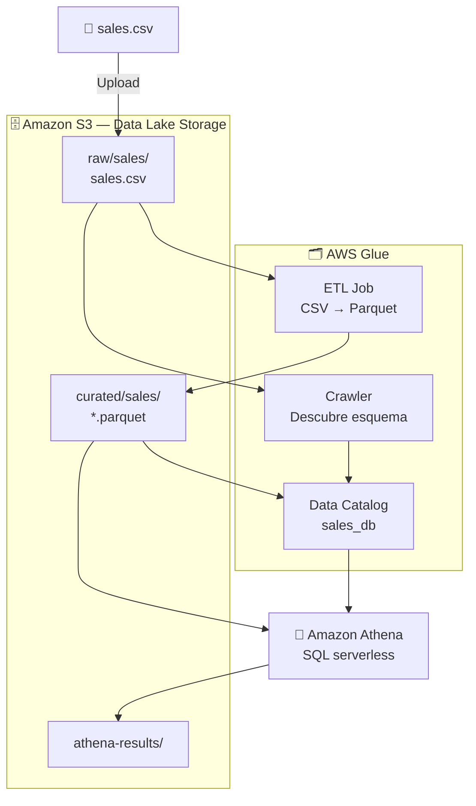

# 🏗️ Data Lake en AWS con S3, Glue y Athena

**Workshop nivel 200 — AWS Console**

Aprende a construir un Data Lake serverless en AWS usando S3 como almacenamiento, Glue para catalogar y transformar datos, y Athena para consultarlos con SQL estándar — sin gestionar ningún servidor.

---

## 🎯 ¿Qué vas a construir?



> 📐 [Ver diagrama completo de arquitectura](assets/architecture.md)

---

## 📋 Pre-requisitos

- Cuenta de AWS activa
- Acceso a la consola de AWS
- Permisos para crear recursos en S3, Glue, Athena e IAM
- Conocimientos básicos de SQL

> ⚠️ **Costos estimados:** Este workshop usa servicios con capa gratuita. El costo total es menor a **$1 USD** si haces cleanup al finalizar.

---

## 📚 Módulos

| # | Módulo | Tiempo |
|---|--------|--------|
| [01](workshop/01-setup.md) | Setup inicial e IAM | 10 min |
| [02](workshop/02-s3-data-lake.md) | S3: estructura del Data Lake | 10 min |
| [03](workshop/03-glue-catalog.md) | Glue: Crawler y Data Catalog | 20 min |
| [04](workshop/04-athena-queries.md) | Athena: consultas SQL | 15 min |
| [05](workshop/05-cleanup.md) | Cleanup de recursos | 5 min |
| [🏠 Bonus](workshop/bonus-particionado.md) | Particionado en S3 *(para hacer en casa)* | 25 min |

**Duración total estimada: ~1 hora** *(+ 25 min bonus opcional)*

---

## 🗂️ Estructura del repositorio

```
aws-data-lake-workshop/
├── README.md
├── presentation/
│   └── data-lake-workshop.md
├── workshop/
│   ├── 01-setup.md
│   ├── 02-s3-data-lake.md
│   ├── 03-glue-catalog.md
│   ├── 04-athena-queries.md
│   └── 05-cleanup.md
├── data/
│   └── sales.csv
└── assets/
```

---

## 🚀 Empezar

Ve al [Módulo 01 → Setup](workshop/01-setup.md)

---

## 📎 Recursos adicionales

- [Documentación Amazon S3](https://docs.aws.amazon.com/s3/)
- [Documentación AWS Glue](https://docs.aws.amazon.com/glue/)
- [Documentación Amazon Athena](https://docs.aws.amazon.com/athena/)
- [AWS Well-Architected Framework](https://aws.amazon.com/architecture/well-architected/)

---

*Workshop creado para la comunidad AWS hispanohablante 🌎*
