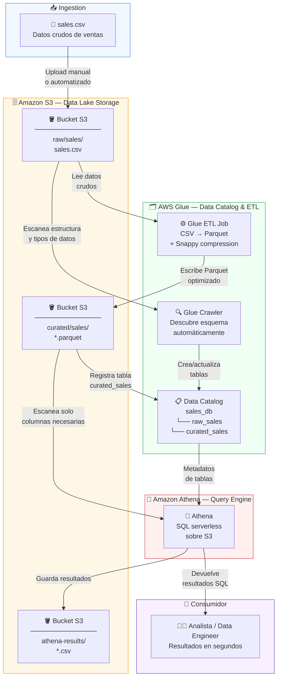

# Arquitectura — Data Lake sin Freno

## Diagrama principal



---

## Flujo de datos detallado

```
┌─────────────────────────────────────────────────────────────────┐
│                        DATA LAKE ARCHITECTURE                   │
│                   "Data Lakes sin Freno" Workshop               │
└─────────────────────────────────────────────────────────────────┘

  [SOURCE]              [STORAGE]              [CATALOG]
                                                    
  sales.csv    ──►  S3: raw/sales/    ──►  Glue Crawler
  (40 orders)       └─ sales.csv           └─ Detecta esquema
                                            └─ Crea tabla
                                                raw_sales
                            │
                            │  Glue ETL Job
                            │  CSV → Parquet (Snappy)
                            ▼
                    S3: curated/sales/  ──►  Data Catalog
                    └─ *.parquet             └─ sales_db
                                             └─ raw_sales
                                             └─ curated_sales
                            │
                            │  [QUERY ENGINE]
                            ▼
                       Amazon Athena
                       └─ SQL estándar
                       └─ Serverless
                       └─ $5/TB escaneado
                            │
                    ┌───────┴────────┐
                    ▼               ▼
             S3: athena-       Resultados
             results/          en consola
             └─ *.csv          └─ tablas
                               └─ gráficos

━━━━━━━━━━━━━━━━━━━━━━━━━━━━━━━━━━━━━━━━━━━━━━━━━━━━━━━━━━━━━━━━━

  CAPAS DEL DATA LAKE

  ┌──────────────┬──────────────────────┬────────────────────────┐
  │    CAPA      │      UBICACIÓN S3    │      FORMATO           │
  ├──────────────┼──────────────────────┼────────────────────────┤
  │ Raw          │ raw/sales/           │ CSV (original)         │
  │ Curated      │ curated/sales/       │ Parquet + Snappy       │
  │ Results      │ athena-results/      │ CSV (output Athena)    │
  └──────────────┴──────────────────────┴────────────────────────┘

  SERVICIOS INVOLUCRADOS

  ┌──────────────┬──────────────────────┬────────────────────────┐
  │   SERVICIO   │       ROL            │    COSTO ESTIMADO      │
  ├──────────────┼──────────────────────┼────────────────────────┤
  │ Amazon S3    │ Almacenamiento       │ < $0.01                │
  │ AWS Glue     │ Catálogo + ETL       │ ~ $0.15                │
  │ Amazon Athena│ Query engine SQL     │ < $0.01                │
  │ IAM          │ Seguridad y accesos  │ Gratis                 │
  └──────────────┴──────────────────────┴────────────────────────┘
```
